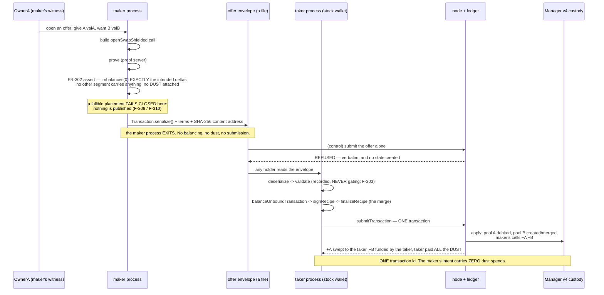
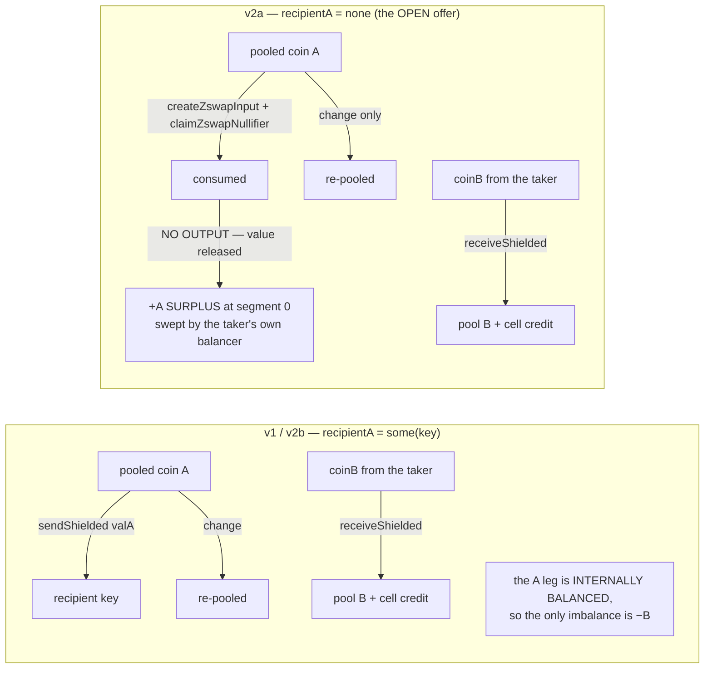

# Unbalanced ZSwaps from contract custody — a contract that makes offers a stranger can take

A contract holds tokens. It emits a **proven, serialized transaction that is deliberately
unbalanced**: it gives colour A out of custody and requires colour B into custody, attaches **no
DUST and no fees**, and **cannot be submitted on its own** — the node refuses it. That artifact is a
file. Anyone who has the file can settle it: an ordinary wallet balances the missing side with its
own coins, merges, pays the whole fee, and the swap executes **atomically under one transaction id**.
Custody loses A **iff** custody gains B.

Two halves are demonstrated and they are never conflated:

- **v1 — named taker.** The offer pays A to a key the maker chose. Proven end to end.
- **v2 — the OPEN offer**, which is what the owner actually required: *"we need a way to make this
  zswap useful in real cases - so that it can be used somehow by any user that has access to it."*
  The contract releases A's value **addressed to nobody at all** — a genuine positive imbalance at
  segment 0 — and a wallet whose keys the maker never knew sweeps it with **stock facade calls only**
  while funding the −B deficit. **This settled. FR-308 openness is GREEN**, via the preferred
  floating-surplus shape.

> **`EXPERIMENTAL_LANE`.** Everything here runs on a pinned **prerelease** component slot (node
> `2.0.0-rc.4`, ledger `9.1.0.0-rc.3`, `midnight-js v5.0.0-beta.6`, wallet-sdk `2.0.0-beta.2`,
> compactc `0.33.0` under recorded deviation **`LANE-DEV-1`**) on a local, fresh dev chain — the
> **same** lane as projects 00003, 00004 and 00005, verified as INHERITED rather than re-pinned, hop
> by hop across all three ancestors at every gate. No result extrapolates to a supported or
> production lane. Pin manifest: [`evidence/g1-lane/LANE.md`](evidence/g1-lane/LANE.md).

> **Two limits are measured, and they are not footnotes.**
> **F-310:** on the shipped Manager v4, a floating-surplus offer is **publishable at one shielded
> custody cell and fallible at two**; the named-taker shape remains guaranteed at two and is fallible
> at four in G5's retained live matrix. The builder correctly refuses to publish a fallible offer.
> G5 also separated publication from settlement: **U1 already works on stock v4** at two cells when
> the maker deliberately bypasses the publication gate and self-merges, while **U2 remains
> publication-bound on stock v4**. The arm-e measurement fixture lifts U2: both shapes stayed
> guaranteed through 16 live cells (no boundary observed), and a foreign wallet settled its
> published file at four cells. Arm-e is measured evidence, not the shipped product.
> **D-307:** because of F-310, the specification's 13-row single-Manager step ledger **cannot run as
> literally written**, so it ran **partitioned across three fresh Managers on one chain in one
> scripted run**, every row keeping the spec's exact amounts and assertions. The owner's decision
> (2026-08-20) is that **this deviation stands as the record of what was tested**. The original spec
> was later lost with a disposable worktree; the canonical reconstructed latest spec preserves the
> original rows and D-307, while the historical G4 hash remains provenance only. The partitioned run
> is **never** presented as the literal table, and G5 did not change the Manager shipped here.

Full report: [`REPORT.md`](REPORT.md) — start there. Command-by-command ledger:
[`VERIFICATION.md`](VERIFICATION.md).

This project (00006) extends [00005](archive/00005/ARCHIVE.md) (`00005-open-colour-custody` @
`e9701e9`, PR #3 merged), whose Manager custodies any colour it is ever credited
with. 00003's, 00004's and 00005's own deliverables are preserved unmodified under
[`archive/00003/`](archive/00003/ARCHIVE.md), [`archive/00004/`](archive/00004/ARCHIVE.md) and
[`archive/00005/`](archive/00005/ARCHIVE.md).

## How a swap actually happens



The two FR-308 shapes differ in **exactly one zswap output**, which is the whole difference between
"a swap with somebody" and "a swap with anybody":



## Repository structure

```
contracts/
  manager.compact                Manager v4 = 00005's v3 + ONE new circuit (F-307: the deploy budget
                                 on this lane is ~13 provable circuits and v3 already had 12)
                                   openSwapShielded(colourA, valA,
                                                    recipientA: Maybe<Either<ZswapCoinPublicKey,
                                                                             ContractAddress>>,
                                                    coinB, creditAccount)
                                 some(key) = v1 named taker / v2b bearer;  none = v2a OPEN offer.
                                 Withdraw and deposit legs are FUSED into one circuit, so a swap is
                                 atomic BY CONSTRUCTION rather than by composing two calls.
  minter.compact                 the issuer — REUSED UNCHANGED from 00004, byte-identical
  minter-collide.compact         00005's P-COLL fixture, inherited untouched
  variants/                      G5 baseline/control and arms (a)–(e): disposable measurement
                                 fixtures only; no fixture or combination is productized here

harness/                       TypeScript driver (midnight-js v5.0.0-beta.6, wallet-sdk 2.0.0-beta.2)
  src/offer/envelope.ts          the offer format: `AA00006-OFFER/1`, one line of JSON terms, then the
                                 RAW transaction bytes; content address = SHA-256 of those bytes
  src/offer/build.ts             build -> prove -> FR-302 fail-closed placement assert -> publish
  src/offer/take.ts              the taker: FOUR fail-closed gates (envelope, expiry, fundability,
                                 pre-submit) then STOCK facade calls only — no transaction surgery;
                                 result stages distinguish local `presubmit` refusal from
                                 balancing/node `settlement` failure and successful `settled`
  src/offer/reader.ts            an offline reader: no network, no wallet, no proof server
  src/swap/expected.ts           the spec's rows and amounts, import-free — one source of numbers
  src/swap/{maker,taker,direct-submit}-process.ts
                                 maker, taker and third-party submitter as SEPARATE OS PROCESSES
  src/swap/stage-{a,b,c}.ts      the three stages of the D-307 partition
  src/swap/record.ts             the evidence index: LEDGER / CELLS / NEGATIVES / DEVIATION
  src/g1/                        spikes S1-S3 (foreign-wallet balancing, segment order, round-trip)
  src/g2/                        spikes S4/S4b/S5b/S5/S6 + the OFFLINE deploy coster (F-307)
  src/g3/                        00005's inherited 18-row ledger machinery, untouched
  src/g4/swap-report.ts          renders REPORT.md from retained evidence — nothing restated by hand
  src/g5/                        G5 offline model, live matrix, calibration, U1/U2 probes, ranking,
                                 and fail-closed evidence validators
  src/node-error.ts              recovers the node's `Custom error: NNN` from inside the facade's
                                 wrapper and decodes it from the pinned node source
  src/test/                      218 offline assertions after audit remediation; 213 passed at audit
                                 HEAD, and 121 is the exact G2/G3-era subset
                                 (00005's 56 unchanged + 39 swap + 26 envelope)

scripts/                       fail-safe gate wrappers — exit 0 (INCLUDING teardown) = gate GREEN
  g1/verify-g1-spikes.sh         lane inheritance (every hop), W-1, W-2, spikes S1-S3    (~40 min)
  g2/verify-g2-contracts.sh      compile, deploy, unit negatives, spikes S4..S6          (~82 min)
  g3/verify-g3-swap-ledger.sh    THE run: stages A, B, C — 23 rows, 217 checks           (~40 min)
  g4/verify-g4-closeout.sh       clean-clone reproduction of G1+G2+G3, then compare      (~3 hours)
  g4/compare-swap-runs.py        the reproduction comparison, incl. the non-vacuous freshness guard
  g5/verify-g5-mitigation.sh     G5 baseline/control/arms, calibration, U1/U2 and ranking (~2.5 h)
  g5/test-early-teardown.sh      Docker/Compose regression: pre-env, post-start and normal teardown
  lib/lane-pins.sh               the lane-inheritance proof, hop by hop from 00003 onward
  lib/docker-w1.sh               W-1 — scratch DOCKER_CONFIG, step 01 of every gate
  lib/nosleep.sh                 W-2 — `caffeinate -is` re-exec, so the host cannot idle-sleep
  lib/failsafe.sh                UTC/argv/exit recording; a teardown failure fails the gate

docker/                        node + indexer + proof server pinned by sha256 digest
evidence/                      retained per gate: run logs, JSON records, generated index pages
  g5-mitigation/                G5 live matrix, DIVERGENT calibration, U1/U2 and ranking evidence
archive/0000{3,4,5}/           the three earlier projects, relocated unmodified
REPORT.md                      the final report — start here
VERIFICATION.md                append-only, command-by-command ledger of the whole project
```

## What was proven, in one table

| Claim | Where |
|---|---|
| a contract emits a proven, unbalanced, DUST-free offer; submitted alone it is REFUSED at three layers | `evidence/g3-swap-ledger/` rows `row-3`, `row-4` |
| ONE transaction id settles it; custody −A +B; the taker paid every SPECK; the maker's intent carries **zero** dust spends | row `row-5` |
| **the OPEN offer**: a wallet the maker never knew swept a surplus addressed to nobody and funded −B | rows `row-7`, `row-8`; `evidence/g2-spikes/OPENNESS.md` |
| the envelope round-trips a real process boundary byte-identically, content address stable | row `row-3`, `evidence/g1-spikes/s3-offer-roundtrip.json` |
| double-take, expiry, tamper, unauthorized make, unbacked make — all refused, verbatim, with no state created | `evidence/g3-swap-ledger/NEGATIVES.md` |
| cancellation by spend works — and the spec's two forms are **two different mechanisms** (codes 239 and 104) | rows `row-12a`, `row-12b` |
| the staleness rule, MEASURED: an intervening same-colour deposit kills a live offer with `239`, not the predicted `104` | row `row-11`, `evidence/g2-spikes/s5.json` |
| G2's original one-cell dose made both shapes flip together; G5's larger live matrix refined the boundary to floating 1→2 and named 2→4 on stock v4 | `evidence/g2-spikes/s5b.json`, `evidence/g5-mitigation/LIVE-MATRIX.md` (**F-310**) |
| the spec's literal row 7 at two cells FAILS CLOSED — so D-307 is evidenced, not asserted | rows `p-f310` (stages A and C) |
| the whole demonstration reproduces from a clean clone on a provably different chain | `evidence/g4-closeout/` |
| **U1 already works on stock v4 past the publication boundary**: a fallible two-cell offer self-merged and settled | `evidence/g5-mitigation/U1-PROBE-V4.md` |
| **U2 was lifted by arm-e**: a foreign wallet settled a published offer at four cells; no live arm-e placement boundary was observed through 16 | `evidence/g5-mitigation/WINNER-ARM-E-ESCROW-4C.md`, `LIVE-MATRIX.md` |

## Reproduce it

Each gate boots its own disposable Docker Compose stack with a unique project name on ports it
verifies free above 10000, and is GREEN only if the wrapper exits 0 **including teardown**.

```bash
./scripts/g1/verify-g1-spikes.sh          # lane inheritance + spikes S1-S3
./scripts/g2/verify-g2-contracts.sh       # Manager v4 + the offer kit + spikes S4/S4b/S5b/S5/S6
./scripts/g3/verify-g3-swap-ledger.sh     # the swap step ledger: stages A, B, C
./scripts/g4/verify-g4-closeout.sh        # clean-clone reproduction of all three, then compare
./scripts/g5/verify-g5-mitigation.sh      # retained G5 command; full live run is ~2.5 hours
./scripts/g5/test-early-teardown.sh       # fast teardown regression; starts one pinned service

./scripts/g2/verify-g2-contracts.sh --offline   # compile + 121 unit assertions + typecheck, no chain
./scripts/g3/verify-g3-swap-ledger.sh --offline  # same, for the ledger machinery
./scripts/g4/verify-g4-closeout.sh --offline     # clone + spec hash + the freshness self-test
./scripts/g5/verify-g5-mitigation.sh --offline   # compile/cost/model the fixtures; no chain

# inspect the authoritative retained G5 endpoint without rerunning the live gate
sed -n '1,220p' evidence/g5-mitigation/RANKING.md
sed -n '1,120p' evidence/g5-mitigation/CALIBRATION.md
```

## Things worth knowing before reusing this harness

- **`validateTransaction` cannot validate a contract-call transaction on this lane, and its refusal
  is a FALSE NEGATIVE** (F-303). The pinned facade validates against a blank `LedgerState`, so it
  reports `call to non-existant contract` for transactions the node then accepts and commits. Run it,
  record it, **never gate on it**.
- **`Transaction.segments()` is not bound to JS** (F-304). `tx.segments?.() ?? [0]` silently degrades
  a placement check to "segment 0 looks right" and would miss a leg parked in a fallible segment. Use
  the harness's `segmentsOf`.
- **`dustBalance` reads 0 for every wallet**, including wallets demonstrably paying fees. "The maker
  paid nothing" is asserted from the settled transaction's **per-intent dust actions**, never from a
  balance.
- **The offer's own `fees()` figure is not the settlement fee** and must never be quoted as a price:
  the fee belongs to the MERGED transaction, whose size the maker cannot know in advance.
- **The envelope's JSON terms line is not authenticated.** Its content address authenticates the
  serialized transaction bytes only. A taker must treat the terms as convenience metadata and rely
  on gate 3, which re-derives the economic terms from the transaction's own imbalances; transaction
  TTL and bearer-key checks also fail safely, but a future production format should bind the terms.
- **Segment assignment is a build-time decision** (F-301 / F-306): re-keying a merged transaction's
  intents afterwards is accepted by the wasm setter and then refused by the node with `235`, even for
  transactions that would have been accepted untouched.
- **Cost the deploy before designing circuits** (F-307): `harness/src/g2/diag-deploy-cost.ts` does it
  offline in seconds. The Manager is now AT the ~13-circuit ceiling.
- **W-1 and W-2 are HOST workarounds**, not lane properties: a scratch `DOCKER_CONFIG`, and a
  `caffeinate -is` re-exec because this Mac idle-slept mid-gate and the resulting `AbortError` is
  indistinguishable from a real refusal in an evidence table.

G5 added four reusable findings, with the full measurements retained under
`evidence/g5-mitigation/`:

- **F-313:** `partitionTranscripts()` makes placement computable offline, but calibration is
  **DIVERGENT** (65/70 live overlap points). Offline absolute boundaries are not lane facts; live
  boundaries are.
- **F-314:** at these pins an ADT-typed intermediate cannot be bound to a local, limiting how much
  deduplication a nested-map design can reuse.
- **F-315:** nested ledger maps expose no outer iterator, so their reported cell count covers
  registered accounts and cannot preserve 00005's exact "zero unaccounted keys" enumeration.
- **F-316:** compiler identity is the unchanged SHA-256 pin; transport moved to the declared LFDT
  release. The relocated archive is byte-identical, so this is not a re-pin.

The gate deliberately treats an arm that fails to deploy as a recorded arm verdict, while missing,
stale, corrupt or contradictory evidence, baseline contradictions, build/prove apparatus failures,
failed required U1/U2 cases, and teardown residue are RED. The strongest map-based measurement is
arm (a) at four cells; arm (e) is the only size-independent direction measured. Their proposed
**(a)+(e)** combination was **not** compiled, costed or measured and is not a product claim.

`EXPERIMENTAL_LANE` / `LANE-DEV-1` — every artifact in this repository carries both labels (FR-309).
