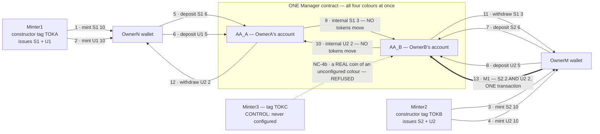
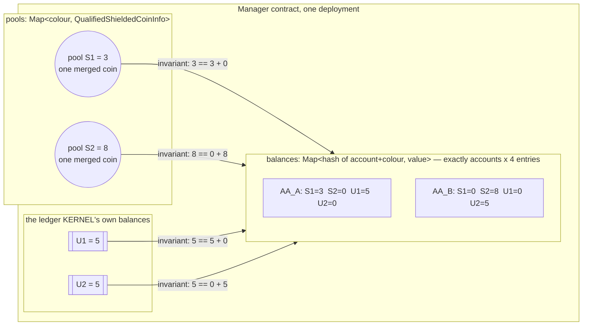
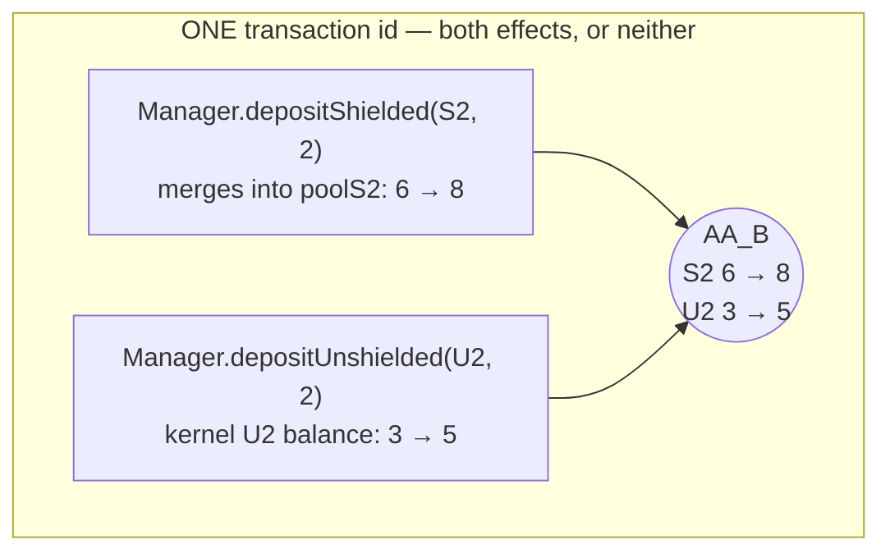

# Multi-token custody on Midnight 2.x — four colours, one Manager

Can **one** contract custody **several different contract-minted token colours at the same time**,
keep them completely isolated from one another, let only the owning account spend each of them, and
move two of them in a **single atomic transaction**? This repo answers that live: four colours (two
shielded, two unshielded, from two deployments of one constructor-parameterized Minter) held
simultaneously by ONE Manager, as a **14-row step ledger that asserts the full 4-party x 4-colour
table after every single step**, with 7 must-fail controls, and a clean-clone reproduction that
matches item for item on a demonstrably different chain.

> **`EXPERIMENTAL_LANE`.** Everything here runs on a pinned **prerelease** component slot
> (node `2.0.0-rc.4`, ledger `9.1.0.0-rc.3`, `midnight-js v5.0.0-beta.6`, wallet-sdk
> `2.0.0-beta.2`, compactc `0.33.0` under recorded deviation `LANE-DEV-1`) on a local, fresh dev
> chain — the **same** lane as project 00003, verified as reused rather than re-pinned. No result
> extrapolates to a supported or production lane. Pin manifest:
> [`evidence/g1-lane/LANE.md`](evidence/g1-lane/LANE.md).

**The headline:** one Manager ended the run holding **two colour-keyed shielded pools and two
unshielded kernel balances at once**, with every one of the 16 party/colour cells exactly where the
specification says it should be. Full report: [`REPORT.md`](REPORT.md).

This project extends [00003](archive/00003/ARCHIVE.md) (`00003-contract-token-custody` @ `a8ebff9`,
PR #1 MERGED), which proved every custody rail for **one** colour per family. 00003's own
deliverables are preserved unmodified under [`archive/00003/`](archive/00003/ARCHIVE.md).

## Repository structure

```
contracts/                      <- the heart of the repo: two Compact contracts
  minter.compact                   the issuer — domain separator in the CONSTRUCTOR, so one source
                                   deployed N times yields N distinct colour families
  manager.compact                  the custodian — colour-keyed pools + per-(account, colour) balances
  probes/                          throwaway compile probes that decided the Manager's shape (D-101)

harness/                        TypeScript driver (midnight-js v5.0.0-beta.6, wallet-sdk 2.0.0-beta.2)
  src/lane.ts                      pinned endpoints + deterministic dev-chain seeds
  src/wallet.ts                    wallet facades: shielded + unshielded + DUST (fees)
  src/manager-view.ts              the Manager's whole ledger, decoded — pools, balances, kernel
  src/g1/                          wallets, NIGHT funding, DUST registration, probe P2
  src/g2/deploy-configure.ts       3 Minters + 1 Manager, 15/15 colour distinctness, configure
  src/g3/                          the four-colour step ledger itself
    expected.ts                      the spec's normative step table, alone and import-free
    observe.ts / table.ts            the 16-cell observation and comparison machinery
    ledger-compose.ts                LEDGER-level composition: two calls in ONE Intent
    controls.ts                      NC-1..5 + M2, each with a funds-byte-identical proof
  src/g4/report.ts                 renders REPORT.md from retained evidence — nothing restated
  src/test/                        45 offline checks incl. a dry run of the whole step table

scripts/                        fail-safe gate wrappers — exit 0 (incl. teardown) = gate GREEN
  g1/verify-g1-lane.sh             lane REUSE proof, compile probes P1/P2, funded wallets   (~8 min)
  g2/verify-g2-contracts.sh        compile, deploy 3 Minters + Manager, configure           (~20 min)
  g3/verify-g3-ledger.sh           THE run: steps 0..13 -> controls -> teardown             (~23 min)
  g4/verify-g4-closeout.sh         clean-clone reproduction of G1+G2+G3 + this report       (~60 min)
  lib/lane-pins.sh                 the lane-reuse proof: five independent pin comparisons
  lib/failsafe.sh                  UTC/argv/exit-code recording; a teardown failure fails the gate

docker/                         node + indexer + proof server pinned by sha256 digest; compiler image
evidence/                       retained per gate: run logs, per-step JSON, the 25-item index
archive/00003/                  project 00003's README/REPORT/VERIFICATION and G5, relocated unmodified
REPORT.md                       the final report — start here
VERIFICATION.md                 append-only, command-by-command ledger of the entire project
```

## The contracts

### [`minter.compact`](contracts/minter.compact) — one source, a colour family per deployment

The domain separator is a **constructor argument**, not a compiled-in constant:

```
constructor(tag: Bytes<32>)      shieldedSep   = persistentHash([tag, "aa00004:minter:shielded"])
                                 unshieldedSep = persistentHash([tag, "aa00004:minter:unshielded"])
colour = tokenType(sep, kernel.self())
```

So two deployments of the **same compiled artifact** differ twice over — by tag *and* by address —
and the token ids are deterministic per deployment. Deployed three times here (`TOKA`, `TOKB`,
`TOKC`), yielding six colours that are **15/15 pairwise distinct**, read from on-chain circuit calls
rather than derived off-chain. Constructor arguments are witness data on this compiler and must be
`disclose`d before they reach ledger state.

### [`manager.compact`](contracts/manager.compact) — four colours, one contract

```
ledger pools:    Map<Bytes<32>, QualifiedShieldedCoinInfo>   one pooled coin PER shielded colour
ledger balances: Map<Bytes<32>, Uint<128>>                   key = persistentHash([account, colour])
                 + the ledger kernel's own unshielded balance per unshielded colour
```

- **Accounts are commitments, not addresses.** `registerAccount(owner)` stores a hash-commitment of
  an owner secret; every mutation authorizes through the `localOwnerSecret()` **witness** choke
  point. No `kernel.caller()`, no address comparison.
- **Guard order is the owner-critical property**: witness choke point -> colour-is-configured ->
  **per-(account, colour) balance** -> pool / contract-ledger balance. The per-account guard sits
  *before* the pool guard, so a rich pool never rescues a poor account.
- **`configure(S1, S2, U1, U2)` is one-time** and is the only gate that admits a colour. It asserts
  all six pairwise comparisons distinct; reconfiguration is rejected.
- **`balanceKey` is exported as a PURE circuit.** It touches no ledger state, so the compiler emits
  no proving key and it lands in `pureCircuits` — which lets the test harness reproduce every key in
  raw ledger state **by running the contract's own code**, instead of reimplementing the hashing
  scheme off-chain. That is what turns "no other cell moved" into an enumeration of real state.
- **Standing invariant, per colour, after every step**: `custody[c] == AA_A[c] + AA_B[c]`. Its two
  sides are maintained by entirely different mechanisms (a zswap coin or the ledger kernel vs. the
  account map), which is what makes it a real cross-check rather than a tautology.

A map slot is **not** a `Cell`: the pool write is `pools.insertCoin(colour, coin, recipient)`,
presence is `pools.member(colour)`, and a fully-spent colour is `pools.remove(colour)`. Whether the
pinned compiler supported this at all was genuinely unknown, so it was settled by compile probes
before a line of the Manager was written — see decision **D-101** in the report.

## What the test does with the tokens

Four value-holding parties: custody accounts **AA_A** (OwnerA) and **AA_B** (OwnerB) *inside* the
Manager, and user wallets **OwnerN** and **OwnerM**. Each colour is minted `10`, and each row of the
table below asserts **all 16 cells**, both pools, both unshielded contract balances, and the
per-colour invariant — a movement in any cell the step does not name is a step failure.



What the Manager is actually holding while all of that happens — the point of the whole project:



The ledger as **observed** (each party cell is `S1/S2/U1/U2`; every row was asserted equal to the
specification's expected value before the run continued — the first divergence would have halted
it):

| Step | Action | OwnerN | OwnerM | AA_A | AA_B | custody |
|---|---|---|---|---|---|---|
| 0 | baseline — deploy 3 Minters + Manager, configure, register AA_A/AA_B | 0/0/0/0 | 0/0/0/0 | 0/0/0/0 | 0/0/0/0 | 0/0/0/0 |
| 1 | Minter1 mints S1 `10` → OwnerN | 10/0/0/0 | 0/0/0/0 | 0/0/0/0 | 0/0/0/0 | 0/0/0/0 |
| 2 | Minter1 mints U1 `10` → OwnerN | 10/0/10/0 | 0/0/0/0 | 0/0/0/0 | 0/0/0/0 | 0/0/0/0 |
| 3 | Minter2 mints S2 `10` → OwnerM | 10/0/10/0 | 0/10/0/0 | 0/0/0/0 | 0/0/0/0 | 0/0/0/0 |
| 4 | Minter2 mints U2 `10` → OwnerM | 10/0/10/0 | 0/10/0/10 | 0/0/0/0 | 0/0/0/0 | 0/0/0/0 |
| 5 | OwnerN deposits S1 `6` → AA_A | 4/0/10/0 | 0/10/0/10 | 6/0/0/0 | 0/0/0/0 | 6/0/0/0 |
| 6 | OwnerN deposits U1 `5` → AA_A | 4/0/5/0 | 0/10/0/10 | 6/0/5/0 | 0/0/0/0 | 6/0/5/0 |
| 7 | OwnerM deposits S2 `6` → AA_B | 4/0/5/0 | 0/4/0/10 | 6/0/5/0 | 0/6/0/0 | 6/6/5/0 |
| 8 | OwnerM deposits U2 `5` → AA_B | 4/0/5/0 | 0/4/0/5 | 6/0/5/0 | 0/6/0/5 | 6/6/5/5 |
| 9 | internal transfer S1 `3`: AA_A → AA_B — **pool unchanged** | 4/0/5/0 | 0/4/0/5 | 3/0/5/0 | 3/6/0/5 | 6/6/5/5 |
| 10 | internal transfer U2 `2`: AA_B → AA_A — **ledger unchanged** | 4/0/5/0 | 0/4/0/5 | 3/0/5/2 | 3/6/0/3 | 6/6/5/5 |
| 11 | AA_B withdraws S1 `3` → OwnerM | 4/0/5/0 | 3/4/0/5 | 3/0/5/2 | 0/6/0/3 | 3/6/5/5 |
| 12 | AA_A withdraws U2 `2` → OwnerN | 4/0/5/2 | 3/4/0/5 | 3/0/5/0 | 0/6/0/3 | 3/6/5/3 |
| 13 | **M1** — OwnerM deposits S2 `2` **and** U2 `2` → AA_B in ONE transaction | 4/0/5/2 | 3/2/0/3 | 3/0/5/0 | 0/8/0/5 | 3/8/5/5 |

Final table, exactly as the specification requires it:

|  | S1 | S2 | U1 | U2 |
|---|---|---|---|---|
| OwnerN | 4 | 0 | 5 | 2 |
| OwnerM | 3 | 2 | 0 | 3 |
| AA_A | 3 | 0 | 5 | 0 |
| AA_B | 0 | 8 | 0 | 5 |
| pool / ledger | poolS1=3 | poolS2=8 | ledgerU1=5 | ledgerU2=5 |

Every colour sums to 10 (= minted); each pool or ledger balance equals the sum of its AA column.
Note steps 9 and 10: an *internal* transfer moves a colour between accounts while the custody figure
for that colour is **byte-identical** before and after, nonce included — no token operation happens
at all. Note also what stays still: S2 never has an internal transfer and U1 is never withdrawn, so
their cells sit at rest through everything else — a colour at rest surviving activity in every other
colour is itself an assertion, checked 14 times.

Per-step evidence — expected vs observed, every observation point, coin nonces, UTXO detail,
transaction ids — is in [`evidence/g3-ledger/step-N/`](evidence/g3-ledger/); the per-item index is
[`evidence/g3-ledger/CELLS.md`](evidence/g3-ledger/CELLS.md).

### The interesting transaction: two colours, one transaction

Step 13 moves a **shielded** colour and an **unshielded** colour in a single transaction — and the
shielded leg *merges* into a pool that already holds 6, so it spends the held pool coin and writes a
new one:



Both same-contract shapes are proven to work on this lane — two calls in **one ledger `Intent`**
(live tx `006acec476e3…`, the exact step-13 shape *including* the merge) and midnight-js's own
**scoped batch** (live tx `00b61d330b2a…`, which is what the gate run used). That is an honest "both
work, one of them here": in the gate's own state the one-Intent assembly was refused at submission
with a bare `1010: Invalid Transaction: Custom error: 223`. That code was afterwards decoded against
the pinned reference tree — it is `SequencingCheckError::CausalityConstraintViolation`, a *codified*
ledger rule that any two calls sharing a contract **address** get an unconditional precedence edge,
and an edge running fallible → guaranteed is fatal. See [`REPORT.md`](REPORT.md) for the citations
and the one narrow question that remains open.

### Proving it can fail — and fails clean

Seven must-fail controls, each asserting the **contract's own** verbatim assert *and* that the full
16-cell table, both pools (value **and** nonce), both unshielded balances and both users'
coins/UTXOs are byte-identical afterwards:

| Control | The attack | Refused by |
|---|---|---|
| **NC-1** | a witness with no registered account tries to withdraw | the authorization choke point |
| **NC-2** | OwnerB's witness reaches for AA_A's S1 — **and the pool covers it** | the per-account guard, which sits *before* the pool guard |
| **NC-3** | AA_A is rich in U1 and S1, and asks for one unit of S2 | the per-(account, colour) guard — wealth in one colour is unspendable in another |
| **NC-4a** | an unshielded deposit **naming** Minter3's colour | the colour guard: `configure` is the only gate |
| **NC-4b** | a **real, on-chain** Minter3 coin offered to `depositShielded` | the colour guard, before the coin is ever received |
| **NC-5** | an internal transfer of a colour AA_A does not hold | the per-(account, colour) guard |
| **M2** | the step-13 transaction with one leg wrong-coloured | the whole transaction fails — no partial credit for the valid leg |

Each proves **three** things, not two: the rejection happened, the message is the contract's own
assert (an unrelated failure recorded as "the guard did its job" would be worthless), and funds are
unchanged — re-read after a settle delay, so "unchanged" is an observation rather than a race.

## Reproducing

Prerequisites: Docker, Node 22+, pnpm. The Compact compiler runs inside a pinned Docker image —
nothing else to install. Each wrapper boots its own disposable stack (unique compose project, random
**verified-free** ports above 10000, bound to `127.0.0.1` only) and tears it down; the gate is green
only if the process **exits 0 including teardown**.

```sh
./scripts/g4/verify-g4-closeout.sh    # ONE command: clean clone -> G1 -> G2 -> G3 -> compare (~60 min)
```

or gate by gate:

```sh
./scripts/g1/verify-g1-lane.sh        # lane REUSE proof, compile probes, funded wallets   (~8 min)
./scripts/g2/verify-g2-contracts.sh   # compile, deploy 3 Minters + Manager, configure     (~20 min)
./scripts/g3/verify-g3-ledger.sh      # the whole 14-row ledger + controls from nothing    (~23 min)
```

A cold pull of the pinned digests adds ~11 minutes the first time.

## Reading order

[`REPORT.md`](REPORT.md) →
[`evidence/g3-ledger/CELLS.md`](evidence/g3-ledger/CELLS.md) →
[`evidence/g2-contracts/CONTRACTS.md`](evidence/g2-contracts/CONTRACTS.md) →
[`evidence/g1-lane/LANE.md`](evidence/g1-lane/LANE.md) →
[`VERIFICATION.md`](VERIFICATION.md).

For project 00003 — the single-colour custody rails this project builds on — see
[`archive/00003/README.md`](archive/00003/README.md) (its links point at 00003's layout and are
stale on this branch by design; the link-correct copy is the `00003-contract-token-custody` branch).
