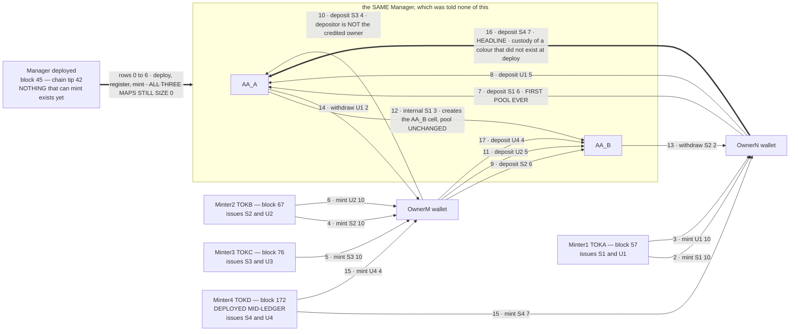
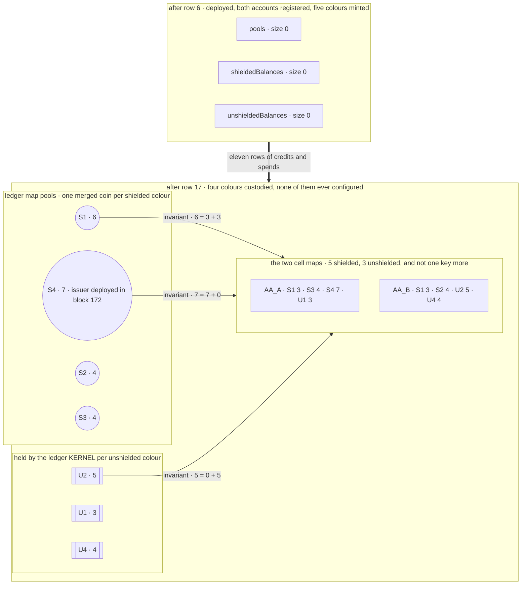
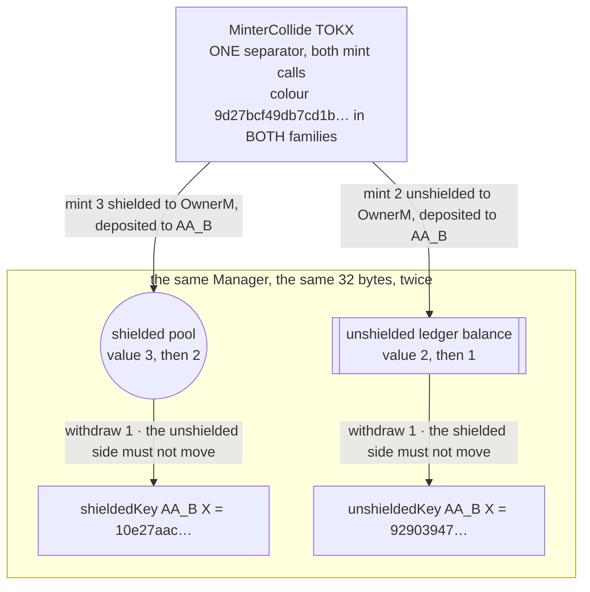

# Open-colour custody on Midnight 2.x — a custodian that was never told the colours

Can one contract custody **any** contract-minted token colour — including colours that **did not
exist when it was deployed** — without a colour list, an allowlist, a `configure` call or an admin
of any kind, and still let only the owning account spend? This repo answers that live.

The Manager is deployed in **block 45**, when the chain tip is **42** and *nothing that can mint a
token exists on the chain at all*. Eighteen rows later it holds four shielded pools and three
unshielded ledger balances — for colours it discovered as they arrived, one of them issued by a
contract deployed in **block 172**, after the Manager had already worked through rows 0–14.

> **`EXPERIMENTAL_LANE`.** Everything here runs on a pinned **prerelease** component slot
> (node `2.0.0-rc.4`, ledger `9.1.0.0-rc.3`, `midnight-js v5.0.0-beta.6`, wallet-sdk
> `2.0.0-beta.2`, compactc `0.33.0` under recorded deviation `LANE-DEV-1`) on a local, fresh dev
> chain — the **same** lane as projects 00003 and 00004, verified as inherited rather than
> re-pinned, at **both** ancestors. No result extrapolates to a supported or production lane. Pin
> manifest: [`evidence/g1-lane/LANE.md`](evidence/g1-lane/LANE.md).

Full report: [`REPORT.md`](REPORT.md). This project (00005) extends
[00004](archive/00004/ARCHIVE.md) (`00004-multi-token-custody` @ `f066a09`, PR #2 held OPEN by the
owner), which proved multi-colour custody but bound its four colours at `configure` time. The
owner's verdict on that design is the reason this project exists:

> *"I dont like we have to hard code the tokens. This will not actually work, as we don't know what
> or how many tokens colors the AA mananger will actually use."*

00003's and 00004's own deliverables are preserved unmodified under
[`archive/00003/`](archive/00003/ARCHIVE.md) and [`archive/00004/`](archive/00004/ARCHIVE.md).

## Repository structure

```
contracts/                      <- the heart of the repo: three Compact contracts
  manager.compact                  the custodian, v3 — FULLY OPEN: no configure, no colour list,
                                   no admin; per-colour custody created lazily on first credit
  minter.compact                   the issuer — REUSED UNCHANGED from 00004, byte-identical
  minter-collide.compact           the P-COLL fixture — ONE separator for BOTH families, so its two
                                   colours are byte-identical by construction

harness/                        TypeScript driver (midnight-js v5.0.0-beta.6, wallet-sdk 2.0.0-beta.2)
  src/lane.ts                      pinned endpoints + deterministic dev-chain seeds
  src/wallet.ts                    wallet facades: shielded + unshielded + DUST (fees)
  src/manager-view.ts              the Manager's whole ledger, decoded — pools, both cell maps, kernel
  src/g1/                          wallets, NIGHT funding, DUST registration
  src/g2/deploy-order.ts           deploy the Manager FIRST, then prove nothing else existed yet
  src/g3/                          the open-colour step ledger itself
    expected.ts                      the spec's normative 18-row table, alone and import-free
    observe.ts                       the DISCOVERED colour registry and the raw-map walk
    table.ts                         observation, comparison, invariant, exact map sizes
    controls.ts                      NC-1..5, each with funds-unchanged AND no-state-created proofs
    probes.ts                        P-COLL, M3 and the 45/45 distinctness sweep
  src/g4/report.ts                 renders REPORT.md from retained evidence — nothing restated
  src/test/                        56 offline checks incl. a dry run of the whole 18-row table

scripts/                        fail-safe gate wrappers — exit 0 (incl. teardown) = gate GREEN
  g1/verify-g1-lane.sh             lane INHERITANCE proof at both ancestors, W-1, wallets  (~3 min)
  g2/verify-g2-contracts.sh        compile, deploy the Manager FIRST, unit negatives      (~10 min)
  g3/verify-g3-ledger.sh           THE run: rows 0..17 -> controls -> probes              (~29 min)
  g4/verify-g4-closeout.sh         clean-clone reproduction of G1+G2+G3 + this report     (~55 min)
  g4/compare-runs.py               the reproduction comparison, incl. the freshness guard
  lib/lane-pins.sh                 the lane-inheritance proof: five comparisons, both ancestors
  lib/docker-w1.sh                 W-1, the inherited host workaround, step 01 of every gate
  lib/failsafe.sh                  UTC/argv/exit-code recording; a teardown failure fails the gate

docker/                         node + indexer + proof server pinned by sha256 digest; compiler image
evidence/                       retained per gate: run logs, per-step JSON, the 30-item index
archive/0000{3,4}/              projects 00003 and 00004, relocated unmodified
REPORT.md                       the final report — start here
VERIFICATION.md                 append-only, command-by-command ledger of the entire project
```

## The contracts

### [`manager.compact`](contracts/manager.compact) — custody with nothing to configure

```
ledger pools:              Map<Bytes<32>, QualifiedShieldedCoinInfo>   one pooled coin per shielded colour
ledger shieldedBalances:   Map<Bytes<32>, Uint<128>>                   key = shieldedKey(account, colour)
ledger unshieldedBalances: Map<Bytes<32>, Uint<128>>                   key = unshieldedKey(account, colour)

shieldedKey(a,c)   = persistentHash([a, c, pad(32, "aa00005:manager:shielded")])
unshieldedKey(a,c) = persistentHash([a, c, pad(32, "aa00005:manager:unshielded")])
```

- **There is no way to tell it about a colour.** `configure`, the colour cells, the `configured`
  flag, both colour predicates and every `assertConfigured*` call site are gone, and
  `registerAccount` no longer seeds a zero cell per configured colour. Registering both accounts
  leaves all three maps at size **0**.
- **Custody is created on FIRST CREDIT only** — a deposit, or the credit side of an internal
  transfer. Every guard in every circuit precedes the first write, so **every refusal path is
  state-neutral by construction**, and "a failed operation creates no state" becomes something the
  tests can assert on map sizes rather than hope for.
- **The two families are separated twice over**: structurally different maps *and* different key
  domains. Either alone would prevent aliasing; both means they could not alias even if the maps
  were merged. That is what the collision probe attacks.
- **Guard order is the owner-critical property**: witness choke point → **per-(account, colour)
  balance, where a MISSING cell reads 0** → pool / contract-ledger balance. The per-account guard
  sits *before* the pool guard, so a rich pool never rescues a poor account — and an account that
  has never held a colour is refused by arithmetic, not by a lookup that could have been forgotten.
- **Credit is open, spend is not.** A deposit may credit any *registered* account, including one the
  depositor does not own (row 10 does exactly that). Only debits pass the witness choke point.
- **`shieldedKey` / `unshieldedKey` are exported PURE circuits**, so the harness reproduces every key
  in raw ledger state by running the contract's own code — which is what makes "zero unaccounted
  keys" an enumeration of real state over a colour set that is *discovered*, not configured.
- `transferInternal` is **split per family** (owner decision D-204): with byte-identical colours
  possible across families, `(to, colour, amount)` could not say which family it meant.

### [`minter-collide.compact`](contracts/minter-collide.compact) — the collision, on purpose

One constructor tag, **one** derived separator, handed to *both* `mintShieldedToken` and
`mintUnshieldedToken`. Its two family colours are byte-identical by construction rather than by
search — `9d27bcf49db7cd1b…` in both families — which is the only honest way to test that a
custodian keeps them apart.

## What the test does with the tokens

Four value-holding parties: custody accounts **AA_A** and **AA_B** *inside* the Manager, and user
wallets **OwnerN** and **OwnerM**. The order of the first two boxes below is the whole point:



**Nothing exists in the Manager until something is credited to it.** This is the same contract at
row 6 and at row 17 — the difference is entirely what arrived:



Every row asserts the **full table over every colour that exists**, every pool, every unshielded
contract balance, the per-colour invariant, conservation per colour, **and the exact size of all
three maps** — plus zero unaccounted keys, meaning every key in raw ledger state is reproducible as
`shieldedKey`/`unshieldedKey` of a registered account and a discovered colour. A movement in any
cell a step did not name is a step failure. The observed ledger (`·` = that colour does not exist
on this chain yet; `maps` = pools/shielded/unshielded):

| Step | Action | AA_A `S1 S2 S3 S4 U1 U2 U3 U4` | AA_B | pool / ledger | maps |
|---|---|---|---|---|---|
| 0 | **Manager deployed — no Minter exists**; AA_A, AA_B registered | `· · · · · · · ·` | `· · · · · · · ·` | `· · · · · · · ·` | `0/0/0` |
| 1 | Minters TOKA, TOKB, TOKC deployed; 6 colours read on-chain | `0 0 0 · 0 0 0 ·` | `0 0 0 · 0 0 0 ·` | `0 0 0 · 0 0 0 ·` | `0/0/0` |
| 2–6 | five colours minted to OwnerN and OwnerM | `0 0 0 · 0 0 0 ·` | `0 0 0 · 0 0 0 ·` | `0 0 0 · 0 0 0 ·` | `0/0/0` |
| 7 | OwnerN deposits S1 `6` → AA_A — **first pool ever** | `6 0 0 · 0 0 0 ·` | `0 0 0 · 0 0 0 ·` | `6 0 0 · 0 0 0 ·` | `1/1/0` |
| 8 | OwnerN deposits U1 `5` → AA_A | `6 0 0 · 5 0 0 ·` | `0 0 0 · 0 0 0 ·` | `6 0 0 · 5 0 0 ·` | `1/1/1` |
| 9 | OwnerM deposits S2 `6` → AA_B | `6 0 0 · 5 0 0 ·` | `0 6 0 · 0 0 0 ·` | `6 6 0 · 5 0 0 ·` | `2/2/1` |
| 10 | OwnerM deposits S3 `4` → **AA_A** | `6 0 4 · 5 0 0 ·` | `0 6 0 · 0 0 0 ·` | `6 6 4 · 5 0 0 ·` | `3/3/1` |
| 11 | OwnerM deposits U2 `5` → AA_B | `6 0 4 · 5 0 0 ·` | `0 6 0 · 0 5 0 ·` | `6 6 4 · 5 5 0 ·` | `3/3/2` |
| 12 | internal transfer S1 `3`: AA_A → AA_B | `3 0 4 · 5 0 0 ·` | `3 6 0 · 0 5 0 ·` | `6 6 4 · 5 5 0 ·` | `3/4/2` |
| 13 | AA_B withdraws S2 `2` → OwnerN | `3 0 4 · 5 0 0 ·` | `3 4 0 · 0 5 0 ·` | `6 4 4 · 5 5 0 ·` | `3/4/2` |
| 14 | AA_A withdraws U1 `2` → OwnerM | `3 0 4 · 3 0 0 ·` | `3 4 0 · 0 5 0 ·` | `6 4 4 · 3 5 0 ·` | `3/4/2` |
| 15 | **TOKD deployed mid-ledger**; S4 `7` → OwnerN, U4 `4` → OwnerM | `3 0 4 0 3 0 0 0` | `3 4 0 0 0 5 0 0` | `6 4 4 0 3 5 0 0` | `3/4/2` |
| 16 | **HEADLINE** — OwnerN deposits S4 `7` → AA_A | `3 0 4 7 3 0 0 0` | `3 4 0 0 0 5 0 0` | `6 4 4 7 3 5 0 0` | `4/5/2` |
| 17 | OwnerM deposits U4 `4` → AA_B | `3 0 4 7 3 0 0 0` | `3 4 0 0 0 5 0 4` | `6 4 4 7 3 5 0 4` | `4/5/3` |

Final table, exactly as the specification requires it — the user wallets included:

|  | S1 | S2 | S3 | S4 | U1 | U2 | U3 | U4 |
|---|---|---|---|---|---|---|---|---|
| OwnerN | 4 | 2 | 0 | 0 | 5 | 0 | 0 | 0 |
| OwnerM | 0 | 4 | 6 | 0 | 2 | 5 | 0 | 0 |
| AA_A | 3 | 0 | 4 | 7 | 3 | 0 | 0 | 0 |
| AA_B | 3 | 4 | 0 | 0 | 0 | 5 | 0 | 4 |
| pool / ledger | 6 | 4 | 4 | 7 | 3 | 5 | 0 | 4 |

End-state map sizes: **4 pools, 5 shielded cells, 3 unshielded cells** — exactly, checked against
the specification's separately written figures rather than derived from the walk. Note row 13:
OwnerN ends holding `S2 = 2`, **a colour it never minted and never deposited**, withdrawn to it out
of AA_B's custody.

### The dormant colour — U3, which does nothing at all

`U3` is minted by no one and deposited by no one. It is a real colour on a real deployed contract,
and the Manager has never heard of it. Every row asserts it reads `0` for all four parties and for
custody, and that it has **no pool, no cell in either map, and no entry in the ledger kernel**.
Control **NC-3** then tries to withdraw one unit of it and re-asserts the same thing afterwards:
a refused operation on a colour the contract has never seen leaves no trace that it was ever asked.

### The collision — one colour, two families, tracked apart



The claim is not made from the state decode alone. Two **real on-chain circuit calls taking the
identical 32-byte argument** answer differently: `shieldedAccountBalance(AA_B, X)` = `2` and
`unshieldedAccountBalance(AA_B, X)` = `1`. And in the same run, the ten TOKA–TOKE colours are
**45/45 pairwise distinct** — every comparison in the project asserts inequality except this one,
which asserts equality on purpose.

### Two brand-new colours, one transaction

Probe **M3** performs the **first** deposits of two colours that exist nowhere in the Manager —
one shielded, one unshielded — inside a single SDK contract-scoped transaction. One transaction id
`00202436c9…150c2a` created one new pool and two new cells: map sizes `5/6/4` → `6/7/5`.

It took two attempts on two fresh wallets. The first was refused by the node with a bare
`1010: Invalid Transaction: Custom error: 104`; the identical composition, retried moments later,
was accepted. That is finding **F-203** in the report — and the reason the probe attempts the
composition twice before it is allowed to report a refusal at all. An earlier run that tried once
concluded the opposite, and it was **wrong**.

### Proving it can fail — and fails clean

Five must-fail controls, each asserting **four** things: the rejection happened; the message is the
contract's **own** assert; the full table, every pool (value *and* nonce), every unshielded balance
and both users' coins/UTXOs are byte-identical afterwards; and **no state was created** — all three
map sizes unchanged, with the specific cell named and proven still absent.

| Control | The attack | Refused by | The cell proven still absent |
|---|---|---|---|
| **NC-1** | a witness with no registered account tries to withdraw | the authorization choke point | no cell for the unregistered witness; accounts still 2 |
| **NC-2** | OwnerB reaches for S3 — **and `poolS3 = 4` covers it** | the per-account guard, which sits *before* the pool guard | `(AA_B, S3)` absent before **and** after |
| **NC-3** | a withdrawal of `U3`, a colour nobody has ever touched | the same guard, reading an absent cell as 0 | U3 absent from *every* map, before and after |
| **NC-4** | a deposit naming an account commitment never registered | the registration guard — credit is open, but only to registered accounts | no cell for the bogus account, no pool for the colour |
| **NC-5** | an internal transfer of S2, which AA_A does not hold | the per-(account, colour) guard | `(AA_A, S2)` absent before **and** after; `poolS2` unchanged |

The no-state-created half is what 00004 could not state at all: with `configure` seeding a fixed
table, "no cell was created" was not a question its contract could be asked.

## Reproducing

Prerequisites: Docker, Node 22+, pnpm. The Compact compiler runs inside a pinned Docker image —
nothing else to install. Each wrapper boots its own disposable stack (unique compose project, random
**verified-free** ports above 10000, bound to `127.0.0.1` only) and tears it down; the gate is green
only if the process **exits 0 including teardown**.

```sh
./scripts/g4/verify-g4-closeout.sh    # ONE command: clean clone -> G1 -> G2 -> G3 -> compare (~55 min)
```

or gate by gate:

```sh
./scripts/g1/verify-g1-lane.sh        # lane inheritance proof at both ancestors, W-1     (~3 min)
./scripts/g2/verify-g2-contracts.sh   # compile, deploy the Manager FIRST, negatives     (~10 min)
./scripts/g3/verify-g3-ledger.sh      # the whole 18-row ledger + controls + probes      (~29 min)
```

A cold pull of the pinned digests adds ~11 minutes the first time.

**The reproduction check refuses to trust itself.** Committed evidence travels into the clone, so a
comparison that only matched verdicts could pass against the very files it was supposed to
reproduce. Before the clone runs anything, G4 feeds the original in as its own "reproduction" and
**requires the comparison to reject it** — on freshness grounds alone, with every substantive check
still passing. Only then does the real comparison mean anything: different addresses, different
colours, different pooled-coin nonces, and **zero transaction ids in common**.

## Reading order

[`REPORT.md`](REPORT.md) →
[`evidence/g3-ledger/CELLS.md`](evidence/g3-ledger/CELLS.md) →
[`evidence/g2-contracts/CONTRACTS.md`](evidence/g2-contracts/CONTRACTS.md) →
[`evidence/g1-lane/LANE.md`](evidence/g1-lane/LANE.md) →
[`VERIFICATION.md`](VERIFICATION.md).

For project 00004 — four colours in one Manager, bound at `configure` time — see
[`archive/00004/README.md`](archive/00004/README.md); for 00003, the single-colour custody rails
both build on, see [`archive/00003/README.md`](archive/00003/README.md). Links inside the archived
documents point at their own layouts and are stale on this branch by design.
