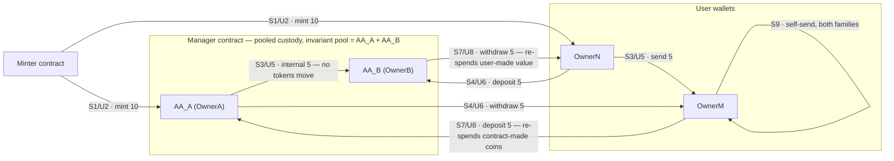
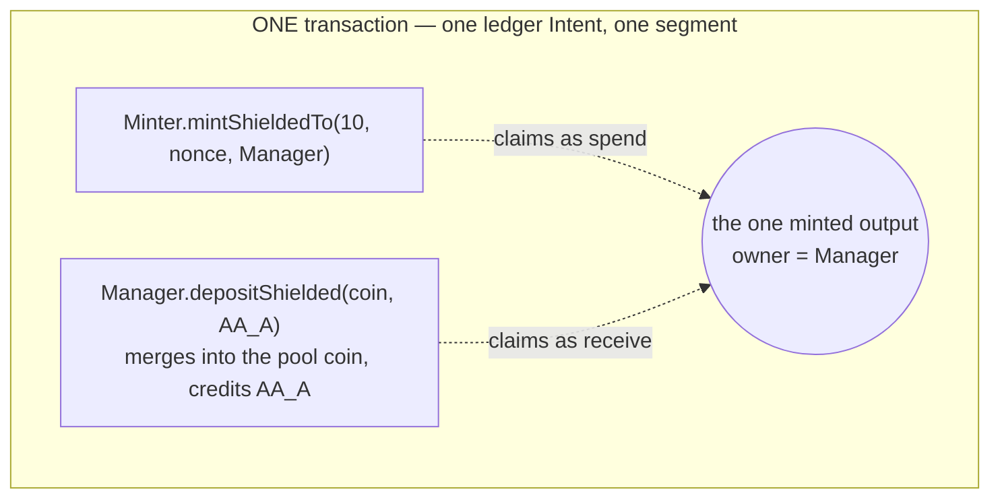

# Contract token custody on Midnight 2.x (`v2.0.0-rc.4`)

Can tokens **minted by a contract** be held, sent, received, split, merged and re-spent across
every combination of **user wallets** and **contract-held custody accounts** — in both the
**shielded** and the **unshielded** family? This repo answers that live, as a ten-step balance
ledger with **26/26 combination-matrix cells GREEN**, five must-fail negative controls, two
atomicity probes, and a clean-clone reproduction that matches cell for cell on a demonstrably
different chain (different contract addresses, zero transaction ids in common).

> **`EXPERIMENTAL_LANE`.** Everything here runs on a pinned **prerelease** component slot
> (node `2.0.0-rc.4`, ledger `9.1.0.0-rc.3`, `midnight-js v5.0.0-beta.6`, wallet-sdk
> `2.0.0-beta.2`, compactc `0.33.0` under recorded deviation `LANE-DEV-1`) on a local, fresh
> dev chain. No result extrapolates to a supported or production lane. Full pin manifest:
> [`evidence/g1-lane/LANE.md`](evidence/g1-lane/LANE.md).

The headline: tokens are **equally spendable regardless of whether their previous holder was a
contract account or a normal wallet** — the run ends with all four parties at `5/5` after value
has crossed every boundary in both directions. Final report: [`REPORT.md`](REPORT.md).

## Repository structure

```
contracts/                      <- the heart of the repo: two Compact contracts
  minter.compact                   the issuer — two contract-scoped colours, mints to ANY recipient
  manager.compact                  the custodian — per-owner accounts over POOLED holdings

harness/                        TypeScript driver (midnight-js v5.0.0-beta.6, wallet-sdk 2.0.0-beta.2)
  src/lane.ts                      pinned endpoints + deterministic dev-chain seeds
  src/wallet.ts                    wallet facades: shielded + unshielded + DUST (fees)
  src/g1/                          wallet creation, NIGHT funding, DUST registration
  src/g3/                          the step-ledger run itself
    contracts.ts                     compact-js CompiledContract wrappers (the owner witness lives here)
    observe.ts                       the two independent observation points behind every assertion
    compose.ts                       SDK-level transaction building
    ledger-compose.ts                LEDGER-level composition: two contract calls in ONE Intent
    run.ts / actions.ts / table.ts   ordered steps 0..9, halt on first divergence
    negative-controls.ts             5 must-fail cases, state AND funds proven unchanged
    atomicity.ts                     2 deferred-failure probes: nothing survives a failed tx
  src/g5/multi-input.ts            ADDENDUM A1 — can the wallet COMBINE inputs? (outside the matrix)
  src/test/                        27 simulator unit tests, incl. every authorization guard

scripts/                        fail-safe gate wrappers — exit 0 (incl. teardown) = gate GREEN
  g1/verify-g1-lane.sh             pin digests, boot isolated stack, fund wallets       (~90 s)
  g2/verify-g2-contracts.sh        compile both contracts, run unit suites, record VKs
  g3/verify-g3-ledger.sh           THE run: fresh stack -> steps 0..9 -> controls -> teardown (~27 min)
  g4/verify-g4-closeout.sh         clean-clone reproduction + final report              (~45 min)
  g5/verify-g5-multi-input.sh      ADDENDUM A1: multi-input coin selection, both families (~9 min)
  lib/failsafe.sh                  UTC/argv/exit-code recording; a teardown failure fails the gate

docker/                         node + indexer + proof server pinned by sha256 digest; compiler image
evidence/                       retained per gate: run logs, per-step JSON, the 26-cell index
REPORT.md                       the final report — start here
VERIFICATION.md                 append-only, command-by-command ledger of the entire project
```

## The contracts

### [`minter.compact`](contracts/minter.compact) — the issuer

Derives two token colours scoped to its own address — `tokenType(domainSep, kernel.self())` —
and mints either to **any recipient**: `mintShieldedTo(value, nonce, recipient)` and
`mintUnshieldedTo(amount, recipient)`.

The deliberate design point: the Compact standard library **auto-receives a token only when the
recipient is `kernel.self()`**. Minting to a *different* contract therefore requires that
contract's receive circuit to run **in the same transaction** — the constraint the whole test is
built around.

### [`manager.compact`](contracts/manager.compact) — the custodian

- **Accounts are commitments, not addresses.** `registerAccount(owner)` stores a hash-commitment
  of an owner secret; every mutation authorizes by the `localOwnerSecret()` **witness** — the
  caller proves in zero knowledge that their secret opens a registered commitment. No
  `kernel.caller()`, no address comparison.
- **Custody is pooled.** All shielded deposits merge into **one pool coin** (`mergeCoin`); all
  unshielded deposits sit in the contract's kernel balance. Who owns what is tracked in per-account
  ledger maps — so an *internal* transfer between accounts moves **no tokens at all** on chain.
- Circuits: `depositShielded` / `depositUnshielded`, `withdrawShielded` / `withdrawUnshielded`,
  `selfSendShielded` / `selfSendUnshielded`, `transferInternal`, plus read-only views.
- **Standing invariant**, asserted after *every* step in *both* families:
  `pooled holdings = AA_A + AA_B`. Its two sides are maintained by entirely different mechanisms
  (zswap coin / kernel balance vs. account maps), which is what makes it a real cross-check.

## What the test does with the tokens

Four value-holding parties: custody accounts **AA_A** (OwnerA) and **AA_B** (OwnerB) inside the
Manager, and user wallets **OwnerN** and **OwnerM**. The Minter issues 20 shielded + 20
unshielded, then the run redistributes until **every party holds `5/5`**, then proves self-sends
change identifiers but not balances.

Every movement happens **twice** — once shielded, once unshielded. Edge labels give both step
numbers as `S<n>/U<m>`:



Step 9 also self-sends the **Manager pool itself** in both families (under OwnerB's
authorization): the balance table and account maps are byte-identical before and after, while the
pool coin nonce / UTXO identifiers provably change.

The ledger as **observed** (balances are `shielded/unshielded` of the Minter's colours only; every
row was asserted against the specification's expected value before the run continued — the first
divergence would have halted it):

| Step | Action | AA_A | OwnerN | AA_B | OwnerM |
|---|---|---|---|---|---|
| 0 | Deploy both contracts; register AA_A, AA_B | 0/0 | 0/0 | 0/0 | 0/0 |
| 1 | Mint **shielded** 10 → AA_A and 10 → OwnerN | 10/0 | 10/0 | 0/0 | 0/0 |
| 2 | Mint **unshielded** 10 → AA_A and 10 → OwnerN | 10/10 | 10/10 | 0/0 | 0/0 |
| 3 | Shielded half: OwnerN →5→ OwnerM; AA_A →5→ AA_B internal | 5/10 | 5/10 | 5/0 | 5/0 |
| 4 | Shielded rest, crossed: OwnerN →5→ AA_B; AA_A →5→ OwnerM | 0/10 | 0/10 | 10/0 | 10/0 |
| 5 | Unshielded half: OwnerN →5→ OwnerM; AA_A →5→ AA_B internal | 0/5 | 0/5 | 10/5 | 10/5 |
| 6 | Unshielded rest, crossed: OwnerN →5→ AA_B; AA_A →5→ OwnerM | 0/0 | 0/0 | 10/10 | 10/10 |
| 7 | Provenance re-send, shielded: OwnerM →5→ AA_A; AA_B →5→ OwnerN | 5/0 | 5/0 | 5/10 | 5/10 |
| 8 | Provenance re-send, unshielded mirror | 5/5 | 5/5 | 5/5 | 5/5 |
| 9 | Self-send round (balance-neutral by design) | 5/5 | 5/5 | 5/5 | 5/5 |

Per-step before/after observations — coin nonces, commitments, UTXO detail, transaction ids — are
in [`evidence/g3-ledger/step-N/`](evidence/g3-ledger/); the per-cell index is
[`evidence/g3-ledger/CELLS.md`](evidence/g3-ledger/CELLS.md).

### The interesting transaction: minting *into* custody

Most edges above are a **single SDK-level call**: a user deposit is just `depositShielded` — the
depositor's wallet supplies the input while balancing, so sender spend and Manager receive land in
one transaction by construction. But the `Minter → AA_A` edge needs **two contracts in one
transaction**, and `midnight-js v5.0.0-beta.6` cannot express that (a scoped transaction refuses a
second contract; merging separately-proven transactions strands each call in its own segment). It
is solved at **ledger level**: one `Intent` carrying both call prototypes, so both sit in one
segment around the single zswap output they both reference —



The Manager's call is the **carrier** (its transaction is a strict superset of the needed zswap
parts once the pool is non-empty). Implementation:
[`harness/src/g3/ledger-compose.ts`](harness/src/g3/ledger-compose.ts); full derivation and the
ruled-out SDK routes: [`evidence/g3-ledger/COMPOSITION.md`](evidence/g3-ledger/COMPOSITION.md).
`CELLS.md` records the level (`SDK` or `LEDGER`) that produced every cell.

### Proving it can fail — and fails clean

Five negative controls, each asserting the exact failure reason **and** that state and funds are
byte-identical afterwards: `wrong-owner-witness`, `unregistered-witness`, `per-account-overdraw`
(pool has enough, the account does not), `omitted-claim-shielded` and `omitted-claim-unshielded`
(a mint to the Manager *without* its receive call must not land). Two atomicity probes (one per
family) submit a withdraw whose on-chain replay diverges, and prove **neither** the token effect
**nor** the account-state change survived. Every assertion in the run reads **two independent
observation points** (contract state vs. pool mechanics; wallet view vs. indexer reconstruction).

## Addendum A1 — multi-input sends

**Verdict: PROVEN in both families.** A wallet holding only pieces **smaller than the amount it
wants to send** combines them into **one** transaction.

This addendum sits **outside the 26-cell matrix** — it claims no matrix cell, and the approved
specification is **unchanged**. It exists because the ordered ledger never forced the case: every
amount it sent was coverable by a single held coin/UTXO, so whether the pinned wallet SDK could
select **two or more inputs** of a contract-minted colour was genuinely untested.

The probe mints **2** and **3** to OwnerN as *two separate transactions*, so OwnerN holds two
discrete pieces and **no single piece covers a send of 4**. OwnerN then sends **4** to OwnerM.

| family | held set | send | after | one transaction |
|---|---|---|---|---|
| shielded | `{2, 3}`, distinct nonces | 4 → OwnerM | OwnerN `{1}`, OwnerM `{4}` — both under **new** nonces | `0054c8910f…b5b81b` |
| unshielded | `{2, 3}`, distinct intent hashes | 4 → OwnerM | OwnerN `{1}`, OwnerM `{4}` — both under a **new** intent hash | `009476730b…60c903` |

The claim is made on **identifier sets**, not balances: both original identifiers are gone from
OwnerN's held set and the change carries a new one. For the unshielded family the indexer confirms
it independently — both consumed outputs report the **same** spending transaction, which is the
send transaction itself, and that transaction created exactly the `4` to OwnerM and the `1` change.
For the shielded family (where a coin is private by construction, so the indexer cannot attribute
it to an owner) the second observation point is the ledger conservation identity: minted `5` =
pool `0` + OwnerN `1` + OwnerM `4`.

Why the ordered ledger never saw it: the pinned balancer accumulates one input per pass until the
imbalance is covered, and its default picker takes the **smallest** coin of the type. In steps 7/8
OwnerM held two 5-pieces and sent 5 — one coin already covered it.

Evidence: [`evidence/g5-multi-input/summary.md`](evidence/g5-multi-input/summary.md) ·
[`shielded.json`](evidence/g5-multi-input/shielded.json) ·
[`unshielded.json`](evidence/g5-multi-input/unshielded.json) ·
[`run.log`](evidence/g5-multi-input/run.log).

## Reproducing

Prerequisites: Docker, Node 22+, pnpm. The Compact compiler runs inside a pinned Docker image —
nothing else to install. Each wrapper boots its own disposable stack (unique compose project,
random verified-free ports above 10000) and tears it down; the gate is green only if the process
**exits 0 including teardown**.

```sh
./scripts/g1/verify-g1-lane.sh        # lane pins + stack + funded wallets   (~90 s)
./scripts/g2/verify-g2-contracts.sh   # compile + 27 unit tests + artifacts
./scripts/g3/verify-g3-ledger.sh      # the whole ledger from nothing        (~27 min)
./scripts/g4/verify-g4-closeout.sh    # clean-clone reproduction + report    (~45 min)
./scripts/g5/verify-g5-multi-input.sh # ADDENDUM A1: multi-input sends       (~9 min)
```

## Reading order

[`REPORT.md`](REPORT.md) →
[`evidence/g3-ledger/CELLS.md`](evidence/g3-ledger/CELLS.md) →
[`evidence/g3-ledger/COMPOSITION.md`](evidence/g3-ledger/COMPOSITION.md) →
[`evidence/g1-lane/LANE.md`](evidence/g1-lane/LANE.md) →
[`VERIFICATION.md`](VERIFICATION.md).
